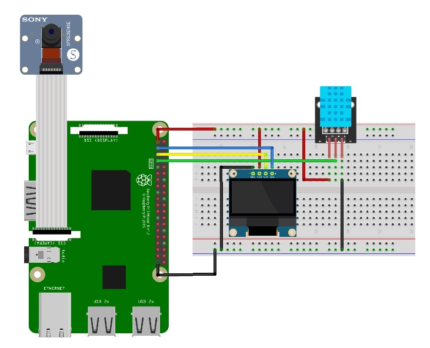
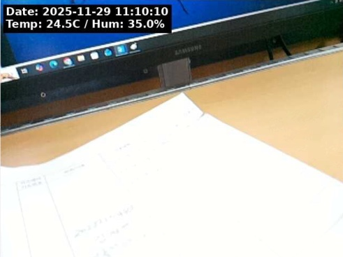
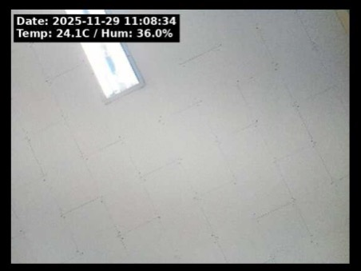

# Smart Monitor for Companion Plants

## 프로젝트 개요
라즈베리파이(Raspberry Pi)를 기반으로 반려식물의 생육 환경(온도, 습도)을 실시간으로 모니터링하고, 일정 주기마다 환경 데이터가 기록된 사진을 자동 촬영하는 임베디드 스마트 카메라 시스템입니다.

## 기술 스택 및 하드웨어
* **Language:** Python 3
* **Hardware:** Raspberry Pi 3 Model B, Raspberry Pi Camera Module, DHT11 (온습도 센서), SSD1306 (OLED 디스플레이)
* **Libraries:** OpenCV, Adafruit_Blinka (DHT, SSD1306), PIL (Python Imaging Library)

## 주요 기능 및 구현 상세
1. **실시간 온습도 모니터링 및 출력**
   * DHT11 센서를 통해 식물 주변의 온도와 습도를 주기적으로 측정합니다.
   * I2C 통신을 이용하여 SSD1306 OLED 디스플레이에 현재 상태를 실시간으로 출력합니다.
2. **주기적 이미지 촬영 및 데이터 오버레이 (Overlay)**
   * `libcamera-jpeg` 명령어를 시스템 콜로 호출하여 일정 주기(기본 60초)마다 사진을 촬영합니다. 노출 및 초점 안정화를 위해 0.5초의 대기 시간을 적용했습니다.
   * 촬영된 이미지를 OpenCV로 로드한 후, PIL을 활용해 사진 좌측 상단에 촬영 일시와 현재 온습도 데이터를 Text Overlay 형태로 각인하여 최종 저장합니다.
3. **예외 처리 및 시스템 안정성**
   * 센서 데이터 읽기 실패 시 `RuntimeError`를 예외 처리하여 시스템이 다운되지 않고 재시도하도록 구현했습니다.

## 📷 시스템 아키텍처 및 하드웨어 구성

> 브레드보드를 활용한 센서 및 디스플레이 결합 회로도

## 📺 실행 결과
### 데이터 오버레이 캡처 화면

*(사진 좌측 상단: 촬영 시점의 날짜, 시간, 온도, 습도 데이터 각인)*

### 실제 회로 영상
[실제 회로 영상 확인하기](./assets/임베디드시스템및실험_영상.mp4)
